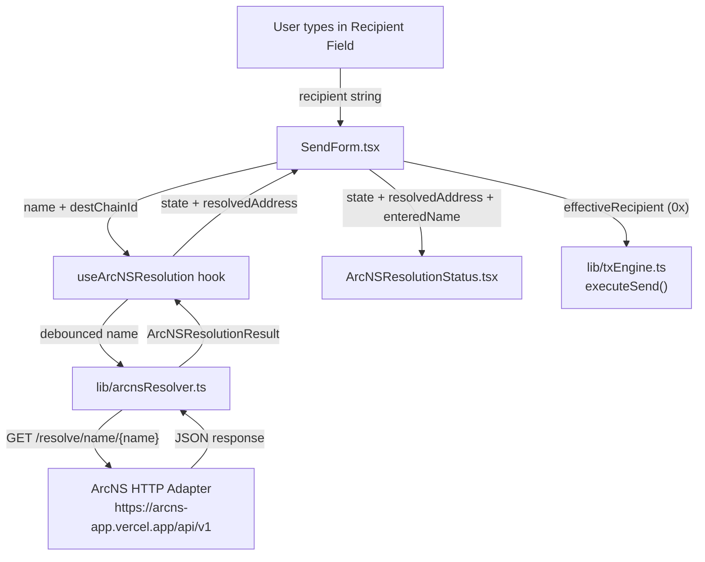
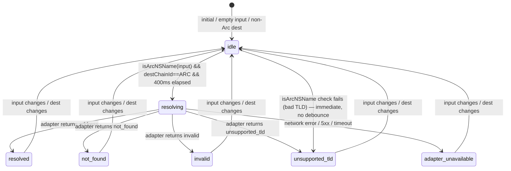

# Design Document: ArcNS Name Sending

## Overview

This feature extends FlowPay's send form to accept ArcNS human-readable names (e.g. `alice.arc`, `alice.circle`) in the recipient field. When a user types a name, FlowPay resolves it to a `0x` wallet address via the ArcNS public HTTP adapter, displays the resolved address for verification, and uses it as the on-chain recipient. All existing `0x` address behaviour is preserved without modification.

The supported route is Arc Testnet → Arc Testnet (same-chain, direct send). ArcNS resolution is only triggered when the destination chain is Arc Testnet.

### Key Design Decisions

- **Resolution is client-side only** — no server-side proxy. The ArcNS adapter is a public HTTPS endpoint; calling it directly from the browser avoids adding a backend dependency.
- **Fail-closed on timeout** — a 10-second `AbortSignal.timeout` ensures the send button stays disabled if the adapter is slow or unreachable.
- **Immediate invalidation on input change** — resolved state is cleared synchronously before the debounce fires, preventing stale addresses from being used.
- **No mutation of the recipient field** — the ArcNS name the user typed stays visible; the resolved address is shown separately beneath the field and in the confirmation panel.
- **ArcNS resolution gated on `destChainId === ARC_CHAIN_ID`** — resolution is meaningless for non-Arc destinations and is suppressed entirely.

---

## Architecture



### Data Flow Summary

1. User types in the recipient field → `recipient` state updates in `SendForm`.
2. `useArcNSResolution(recipient, destChainId)` reacts:
   - If `destChainId !== ARC_CHAIN_ID` → returns `{ state: 'idle', resolvedAddress: null }` immediately.
   - If `recipient` is not an ArcNS name → returns `{ state: 'idle', resolvedAddress: null }`.
   - Otherwise: resets to `idle` immediately, then after 400 ms debounce calls `resolveArcNSName`.
3. `resolveArcNSName` validates TLD, calls the adapter, maps the response to `ArcNSResolutionResult`.
4. `SendForm` derives `effectiveRecipient`:
   - If `isArcNSName(recipient) && state === 'resolved'` → `resolvedAddress`
   - Otherwise → `recipient` (raw input, unchanged)
5. `canSubmitStep1` blocks if `isArcNSName(recipient) && state !== 'resolved'`.
6. `executeSend` / `executeSourceTx` receive `effectiveRecipient` (always a `0x` address at send time).

---

## Components and Interfaces

### `lib/arcnsResolver.ts`

Pure async utility — no React, no side effects beyond the HTTP call.

```typescript
export type ResolutionState =
  | 'idle'
  | 'resolving'
  | 'resolved'
  | 'not_found'
  | 'invalid'
  | 'unsupported_tld'
  | 'adapter_unavailable';

export interface ArcNSResolutionResult {
  state: ResolutionState;
  address?: string; // present only when state === 'resolved'
}

export const SUPPORTED_TLDS: string[] = ['.arc', '.circle'];

export function isArcNSName(input: string): boolean;

export async function resolveArcNSName(
  name: string,
  signal?: AbortSignal
): Promise<ArcNSResolutionResult>;
```

**Behaviour:**
- `isArcNSName(input)` returns `true` if `input` ends with a supported TLD and has a non-empty label before the dot.
- `resolveArcNSName` validates TLD first — returns `{ state: 'unsupported_tld' }` without fetching if TLD is not supported.
- Merges caller `signal` with `AbortSignal.timeout(10_000)` using `AbortSignal.any([...])`.
- Maps adapter JSON `status` field to `ResolutionState`.
- Network errors and HTTP 5xx → `{ state: 'adapter_unavailable' }`.
- Never throws — always returns a typed result.

### `hooks/useArcNSResolution.ts`

```typescript
export function useArcNSResolution(
  name: string,
  destChainId: number
): { state: ResolutionState; resolvedAddress: string | null }
```

**Behaviour:**
- Returns `{ state: 'idle', resolvedAddress: null }` immediately when `destChainId !== ARC_CHAIN_ID`.
- On `name` change: synchronously resets state to `idle` and `resolvedAddress` to `null`, then schedules a 400 ms debounced call to `resolveArcNSName`.
- On `destChainId` change away from `ARC_CHAIN_ID`: synchronously resets to `idle`.
- Cancels in-flight requests via `AbortController` when name changes before the response arrives.
- Does not call `resolveArcNSName` if `!isArcNSName(name)`.

### `components/ArcNSResolutionStatus.tsx`

```typescript
interface ArcNSResolutionStatusProps {
  state: ResolutionState;
  resolvedAddress: string | null;
  enteredName: string;
}

export function ArcNSResolutionStatus(props: ArcNSResolutionStatusProps): JSX.Element | null
```

Renders nothing when `state === 'idle'`. For all other states renders a small inline status row beneath the recipient input.

### `components/SendForm.tsx` (modifications)

New imports and hook usage:
```typescript
import { useArcNSResolution } from '@/hooks/useArcNSResolution';
import { isArcNSName } from '@/lib/arcnsResolver';
import { ArcNSResolutionStatus } from './ArcNSResolutionStatus';

// Inside SendForm:
const { state: arcnsState, resolvedAddress } = useArcNSResolution(recipient, destChainId);

const effectiveRecipient = isArcNSName(recipient) && arcnsState === 'resolved' && resolvedAddress
  ? resolvedAddress
  : recipient;

const isValidAddress = /^0x[a-fA-F0-9]{40}$/.test(effectiveRecipient);

const canSubmitStep1 =
  isConnected &&
  isValidAddress &&
  isValidAmount &&
  !!sourceChain &&
  !!destChain &&
  walletOnSource &&
  !(isArcNSName(recipient) && arcnsState !== 'resolved'); // block while resolving/error
```

Recipient input placeholder changes from `"0x..."` to `"0x... or name.arc"`.

`executeSend` / `executeSourceTx` calls replace `recipient` with `effectiveRecipient`.

`<ArcNSResolutionStatus>` is rendered beneath the recipient input when `isArcNSName(recipient)`.

Confirmation panel (step 2 cross-chain panel and send button label) shows both the entered name and resolved address when applicable.

**Arc → Arc same-chain route:** The destination selector currently filters `CHAIN_LIST.filter((c) => c.id !== sourceChainId)`, which prevents selecting Arc as destination when Arc is the source. This filter must be relaxed to allow Arc → Arc. The `handleDestChange` swap logic must also be updated to not swap chains when both source and dest are Arc Testnet.

---

## Data Models

### Adapter API Contract

```
GET https://arcns-app.vercel.app/api/v1/resolve/name/{name}
```

Expected response shape (inferred from ArcNS adapter conventions):

```typescript
interface AdapterResponse {
  status: 'resolved' | 'not_found' | 'invalid' | 'unsupported_tld';
  address?: string; // present when status === 'resolved'
}
```

HTTP error codes:
- `200` with `status: 'resolved'` → success
- `200` with `status: 'not_found'` → name exists but no address record
- `200` with `status: 'invalid'` → malformed name
- `200` with `status: 'unsupported_tld'` → TLD not supported by adapter
- `5xx` → treat as `adapter_unavailable`
- Network error / timeout → treat as `adapter_unavailable`

### State Machine



### `effectiveRecipient` Derivation

| `recipient` value | `arcnsState` | `effectiveRecipient` | `isValidAddress` |
|---|---|---|---|
| `0x1234...abcd` (valid hex) | `idle` | `0x1234...abcd` | `true` |
| `alice.arc` | `resolved` | `resolvedAddress` (0x...) | `true` |
| `alice.arc` | `resolving` | `alice.arc` | `false` |
| `alice.arc` | `not_found` | `alice.arc` | `false` |
| `alice.arc` | `adapter_unavailable` | `alice.arc` | `false` |
| `alice.eth` | `unsupported_tld` | `alice.eth` | `false` |
| `` (empty) | `idle` | `` | `false` |

---

## Correctness Properties

*A property is a characteristic or behavior that should hold true across all valid executions of a system — essentially, a formal statement about what the system should do. Properties serve as the bridge between human-readable specifications and machine-verifiable correctness guarantees.*

### Property 1: ArcNS name classification is mutually exclusive with valid 0x addresses

*For any* string that is a valid `0x` address (exactly `0x` followed by 40 hex characters), `isArcNSName()` SHALL return `false`; and *for any* string ending in `.arc` or `.circle` with a non-empty label, `isArcNSName()` SHALL return `true`.

**Validates: Requirements 1.1, 1.2, 1.3**

### Property 2: Unsupported TLD never triggers a fetch

*For any* name string whose TLD is not in `SUPPORTED_TLDS`, calling `resolveArcNSName` SHALL return `{ state: 'unsupported_tld' }` and SHALL NOT call `fetch`.

**Validates: Requirements 1.4, 6.3**

### Property 3: Resolved address is always a valid 0x address

*For any* ArcNS name for which `resolveArcNSName` returns `{ state: 'resolved' }`, the `address` field SHALL be a string matching `/^0x[a-fA-F0-9]{40}$/`.

**Validates: Requirements 2.2, 7.6**

### Property 4: effectiveRecipient is always a valid 0x address at send time

*For any* combination of `recipient` input and `arcnsState`, if `canSubmitStep1` is `true`, then `effectiveRecipient` SHALL match `/^0x[a-fA-F0-9]{40}$/`.

**Validates: Requirements 4.1, 4.2, 4.3**

### Property 5: Input change always resets resolution state to idle

*For any* resolved ArcNS name, changing the `recipient` input to any different value SHALL immediately set `arcnsState` to `idle` and `resolvedAddress` to `null` — before any debounce fires.

**Validates: Requirements 2.9, 4.5**

### Property 6: Non-Arc destination always yields idle resolution state

*For any* `destChainId` that is not `ARC_CHAIN_ID`, `useArcNSResolution` SHALL return `{ state: 'idle', resolvedAddress: null }` regardless of the `name` input.

**Validates: Requirements 5.4, 2.10**

### Property 7: Resolver is idempotent for the same input and adapter response

*For any* ArcNS name and any fixed mock adapter response, calling `resolveArcNSName` multiple times with the same arguments SHALL always return a result with the same `state` and `address`.

**Validates: Requirements 6.4**

### Property 8: Error message rendered matches resolution state

*For any* `state` in `{ not_found, unsupported_tld, invalid, adapter_unavailable }`, `ArcNSResolutionStatus` SHALL render the exact prescribed message string for that state.

**Validates: Requirements 3.4, 3.5, 3.6, 3.7**

---

## Error Handling

| Failure scenario | Behaviour |
|---|---|
| Network error (fetch throws) | `resolveArcNSName` catches, returns `{ state: 'adapter_unavailable' }` |
| HTTP 5xx from adapter | Detected via `!response.ok`, returns `{ state: 'adapter_unavailable' }` |
| Adapter timeout (>10s) | `AbortSignal.timeout(10_000)` fires, caught as `AbortError`, returns `{ state: 'adapter_unavailable' }` |
| User cancels (name changes) | Caller `AbortSignal` fires, caught as `AbortError`; hook discards result silently |
| Adapter returns `not_found` | Returns `{ state: 'not_found' }` |
| Adapter returns `invalid` | Returns `{ state: 'invalid' }` |
| Unsupported TLD | Detected before fetch, returns `{ state: 'unsupported_tld' }` |
| Malformed JSON from adapter | Caught in try/catch, returns `{ state: 'adapter_unavailable' }` |
| `resolvedAddress` is not a valid 0x | Treated as `not_found` (defensive guard in resolver) |

The send button (`canSubmitStep1`) remains disabled for all non-`resolved` ArcNS states, ensuring no transaction is ever submitted with an unresolved or invalid recipient.

---

## Testing Strategy

### Unit Tests — `__tests__/arcnsResolver.test.ts`

Uses **vitest** (confirmed in `package.json` devDependencies). `fetch` is mocked globally via `vi.stubGlobal('fetch', ...)`.

Test cases:

1. **resolved** — mock adapter returns `{ status: 'resolved', address: '0xabc...123' }` → result is `{ state: 'resolved', address: '0xabc...123' }`.
2. **not_found** — mock adapter returns `{ status: 'not_found' }` → result is `{ state: 'not_found' }`.
3. **unsupported_tld** — input is `name.eth` → result is `{ state: 'unsupported_tld' }`, `fetch` not called.
4. **adapter_unavailable (network error)** — `fetch` throws `TypeError: Failed to fetch` → result is `{ state: 'adapter_unavailable' }`.
5. **invalid** — mock adapter returns `{ status: 'invalid' }` → result is `{ state: 'invalid' }`.
6. **round-trip property (PBT)** — *For any* name that resolves to `resolved`, the returned `address` matches `/^0x[a-fA-F0-9]{40}$/`. Use `@fast-check/vitest` to generate random valid hex addresses as mock adapter responses.
7. **stale result invalidation** — after a successful resolution, changing the name in the hook resets state to `idle` immediately (hook-level test using `renderHook` + `act`).

### Property-Based Tests

Use **`@fast-check/vitest`** for property tests. Each property test runs a minimum of 100 iterations.

| Property | Generator | Assertion |
|---|---|---|
| P1: Classification mutual exclusivity | `fc.hexaString({ minLength: 40, maxLength: 40 })` for 0x addresses; `fc.string()` + `.arc`/`.circle` suffix for ArcNS names | `isArcNSName` returns correct boolean |
| P2: Unsupported TLD no fetch | `fc.string()` + random non-`.arc`/`.circle` TLD suffix | `fetch` not called, state is `unsupported_tld` |
| P3: Resolved address validity | Mock adapter returning `fc.hexaString({ minLength: 40, maxLength: 40 })` prefixed with `0x` | `address` matches hex regex |
| P7: Resolver idempotence | Fixed mock response + `fc.string()` valid ArcNS name | Same state returned on repeated calls |

Tag format for each property test:
```
// Feature: arcns-name-sending, Property N: <property_text>
```

### Integration / Example Tests

- `isArcNSName('')` → `false` (empty input)
- `determineRoute(ARC_CHAIN_ID, ARC_CHAIN_ID)` → `{ needsBridge: false, mode: 'direct' }` (Arc → Arc route)
- `useArcNSResolution` hook: `destChainId !== ARC_CHAIN_ID` → always `idle`
- `useArcNSResolution` hook: debounce — rapid typing fires fetch only once after 400 ms (fake timers)
- `useArcNSResolution` hook: AbortController — in-flight request is aborted when name changes
- `SendForm` snapshot: recipient input placeholder shows `"0x... or name.arc"`
- `ArcNSResolutionStatus`: renders `null` for `idle` state
- `ArcNSResolutionStatus`: renders spinner for `resolving` state
- `ArcNSResolutionStatus`: renders resolved address for `resolved` state

### Non-Regression

All existing `0x` address send paths must continue to work. The `effectiveRecipient` derivation ensures that when `isArcNSName(recipient)` is `false`, `recipient` is passed through unchanged to `executeSend`.
